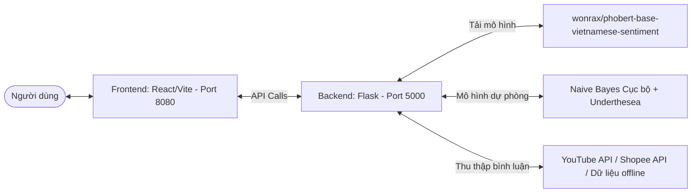

# 🤖 AI Comment Analyzer Pro - Hướng Dẫn Khởi Chạy Hệ Thống

Chào mừng bạn đến với dự án **AI Comment Analyzer Pro** - Hệ thống phân tích cảm xúc bình luận đa nền tảng thời gian thực sử dụng trí tuệ nhân tạo (PhoBERT & DistilBERT). Dự án được thiết kế theo cấu trúc tách biệt chuyên nghiệp giữa **Backend (Flask API)** và **Frontend (React / Vite Web App)**.

Tài liệu này sẽ hướng dẫn bạn từng bước cài đặt, khởi chạy đồng thời cả hai server và cách vận hành dự án dễ dàng nhất.

---

## 📐 Kiến trúc Giao tiếp Hệ thống



---

## 📋 Yêu Cầu Hệ Thống

Trước khi bắt đầu, hãy đảm bảo máy tính của bạn đã cài đặt các công cụ sau:
1. **Python 3.8 - 3.11** (Khuyến nghị bản **3.10.x** hoặc **3.11.x** để tương thích tốt nhất với PyTorch và Underthesea).
2. **Node.js (v18+)** & **npm** (Để quản lý và chạy giao diện Frontend React).
3. **Git** (Để quản lý mã nguồn).

> [!IMPORTANT]
> **Dành cho người dùng Windows:** Khi cài đặt Python, bắt buộc phải tích chọn ô **"Add python.exe to PATH"** ở màn hình đầu tiên để có thể chạy được lệnh Python từ CMD hoặc PowerShell.

---

## 🚀 Hướng Dẫn Khởi Chạy Nhanh (One-Click)

Để hỗ trợ khởi chạy hệ thống một cách nhanh nhất trên hệ điều hành Windows mà không cần mở nhiều cửa sổ lệnh thủ công, dự án cung cấp tệp script **`run_all.bat`** ở thư mục gốc.

* **Cách thực hiện:** Bạn chỉ cần nhấp đúp chuột vào file **`run_all.bat`** ở thư mục gốc của dự án.
* **Hoạt động:** Script sẽ tự động chia đôi tiến trình, khởi chạy máy chủ **Backend Flask API** trên cổng `5000` ở một cửa sổ CMD riêng và khởi chạy máy chủ phát triển **Frontend Vite React** trên cổng `8080` ở một cửa sổ CMD riêng khác.
* **Đường dẫn truy cập:**
  * ➜ **Giao diện Web React:** [http://localhost:8080](http://localhost:8080)
  * ➜ **Backend API Server:** [http://localhost:5000](http://localhost:5000)

---

## 🛠️ Hướng Dẫn Khởi Chạy Thủ Công (Terminal)

Nếu bạn muốn kiểm soát chi tiết tiến trình hoặc chạy trên hệ điều hành khác (macOS, Linux), bạn có thể chạy thủ công hai server bằng cách mở hai cửa sổ terminal độc lập:

### 1️⃣ Khởi Chạy Backend (Flask API Server)

1. Mở cửa sổ Terminal mới và di chuyển vào thư mục backend:
   ```bash
   cd BE_HTPTBinhLuan
   ```
2. Tạo môi trường ảo Python `.venv` (nếu chưa có):
   ```bash
   python -m venv .venv
   ```
3. Kích hoạt môi trường ảo:
   * **Windows (Command Prompt - CMD):**
     ```cmd
     .venv\Scripts\activate.bat
     ```
   * **Windows (PowerShell):**
     ```powershell
     .venv\Scripts\Activate.ps1
     ```
   * **macOS / Linux:**
     ```bash
     source .venv/bin/activate
     ```
4. Cài đặt các thư viện phụ thuộc:
   ```bash
   pip install -r requirements.txt
   ```
5. Khởi chạy Flask Server:
   ```bash
   python api_server.py
   ```
   *Server sẽ chạy tại địa chỉ: `http://localhost:5000`*

---

### 2️⃣ Khởi Chạy Frontend (React / Vite Web App)

1. Mở một cửa sổ Terminal mới khác và di chuyển vào thư mục frontend:
   ```bash
   cd FE_HTPTBinhLuan
   ```
2. Cài đặt các gói thư viện Node.js:
   ```bash
   npm install
   ```
3. Khởi chạy máy chủ phát triển:
   ```bash
   npm run dev
   ```
4. Mở trình duyệt và truy cập vào liên kết:
   * **Địa chỉ truy cập:** [http://localhost:8080](http://localhost:8080)

---

## 🧠 Cơ Chế Tải Mô Hình AI & Chế Độ Dự Phòng (Fallback)

Nhằm tối ưu hóa hiệu năng và mang lại trải nghiệm mượt mà, hệ thống phân tích cảm xúc được thiết lập với cơ chế vận hành thông minh:

1. **Tải ngầm bất đồng bộ (Background Preloading):**
   Ngay khi Flask Server bắt đầu khởi động, một luồng phụ ngầm (daemon thread) được kích hoạt để tải mô hình **PhoBERT** (`wonrax/phobert-base-vietnamese-sentiment`). Điều này giúp server chính phản hồi API ngay lập tức mà không bị chặn (blocking) bởi thời gian load PyTorch khá nặng ban đầu.
2. **Thời gian tải lần đầu:**
   Lần chạy đầu tiên sẽ mất **khoảng 1-3 phút** tùy thuộc vào tốc độ mạng để tải file weights của mô hình (~370MB) từ HuggingFace Hub. Các lần chạy tiếp theo sẽ sử dụng tệp tin đã lưu cache trên máy nên sẽ sẵn sàng ngay lập tức.
3. **Hiển thị trạng thái AI trên Frontend:**
   Giao diện Frontend React tích hợp thanh trạng thái AI (AI Status Banner) ở đầu trang hiển thị tiến trình của mô hình:
   * 🟣 **Đang tải (Loading):** PhoBERT đang được tải ngầm. Người dùng vẫn có thể phân tích bình luận bình thường; hệ thống sẽ tự động dùng mô hình học máy **Naive Bayes cục bộ kết hợp tách từ Underthesea** (`mo_hinh_ai.pkl`) làm baseline dự phòng chất lượng cao.
   * 🟢 **Sẵn sàng (Ready):** PhoBERT đã tải xong! Mọi lượt phân tích tiếp theo sẽ sử dụng PhoBERT với độ chính xác cao nhất (áp dụng xử lý theo lô - batch size 32 để tăng tốc độ phân tích gấp 10 lần).
   * 🔴 **Lỗi (Error):** Nếu mất mạng hoặc cấu hình RAM máy chủ không đủ để chạy PhoBERT, hệ thống tự động chuyển sang mô hình Naive Bayes hoặc bộ phân tích từ điển thô sơ để đảm bảo hệ thống phản hồi 100%.

---

Chúc bạn có trải nghiệm tuyệt vời với **AI Comment Analyzer Pro**!
