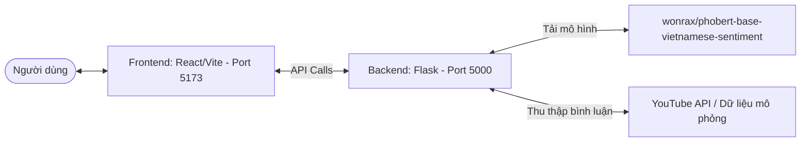

# 🤖 AI Comment Analyzer Pro - Hướng Dẫn Khởi Chạy Hệ Thống

Chào mừng bạn đến với dự án **AI Comment Analyzer Pro** - Hệ thống phân tích cảm xúc bình luận đa nền tảng thời gian thực sử dụng trí tuệ nhân tạo (PhoBERT & DistilBERT). Dự án được thiết kế theo cấu trúc tách biệt giữa **Backend (Flask API)** và **Frontend (React / Vite)**.

Tài liệu này sẽ hướng dẫn bạn từng bước cài đặt, khởi chạy và khắc phục sự cố để vận hành dự án một cách trơn tru nhất.

---

## 📐 Kiến trúc Giao tiếp Hệ thống



---

## 📋 Yêu Cầu Hệ Thống

Trước khi bắt đầu, hãy đảm bảo máy tính của bạn đã cài đặt các công cụ sau:
1. **Python 3.8 - 3.11** (Khuyến nghị bản **3.10.x** để tương thích tốt nhất với PyTorch và Underthesea).
2. **Node.js (v18+)** & **npm** (Để quản lý và chạy giao diện Frontend).
3. **Git** (Để quản lý mã nguồn).

> [!IMPORTANT]
> **Dành cho người dùng Windows:** Khi cài đặt Python, bắt buộc phải tích chọn ô **"Add python.exe to PATH"** ở màn hình đầu tiên để có thể chạy được lệnh Python từ CMD hoặc PowerShell.

---

## 🚀 Hướng Dẫn Khởi Chạy Chi Tiết

Dự án được chia làm 2 thư mục chính độc lập: `BE_HTPTBinhLuan` (Backend) và `FE_HTPTBinhLuan` (Frontend). Bạn cần khởi chạy cả hai để hệ thống hoạt động đầy đủ.

### 1️⃣ Khởi Chạy Backend (Flask API Server)

Cửa ngõ xử lý dữ liệu, cào bình luận và phân tích cảm xúc bằng mô hình AI.

#### Cách 1: Khởi chạy thủ công qua Terminal (Khuyên dùng)
1. Mở cửa sổ Terminal (CMD hoặc PowerShell) và di chuyển vào thư mục backend:
   ```bash
   cd BE_HTPTBinhLuan
   ```
2. Tạo môi trường ảo Python `.venv` (nếu chưa có):
   ```bash
   python -m venv .venv
   ```
3. Kích hoạt môi trường ảo:
   * **Windows (Command Prompt - CMD):**
     ```cmd
     .venv\Scripts\activate.bat
     ```
   * **Windows (PowerShell):**
     ```powershell
     .venv\Scripts\Activate.ps1
     ```
     *(Nếu gặp lỗi bảo mật Permission, chạy lệnh: `Set-ExecutionPolicy -Scope Process -ExecutionPolicy Bypass` rồi kích hoạt lại)*
   * **macOS / Linux:**
     ```bash
     source .venv/bin/activate
     ```
4. Nâng cấp `pip` và cài đặt các thư viện phụ thuộc:
   ```bash
   python -m pip install --upgrade pip
   pip install -r requirements.txt
   ```
5. Khởi chạy Flask Server:
   ```bash
   python api_server.py
   ```
   *Server sẽ khởi động tại địa chỉ: `http://localhost:5000`*

#### Cách 2: Chạy nhanh bằng One-click Script (Chỉ áp dụng cho Windows)
* Nhấp đúp chuột vào file **`run_app.bat`** nằm trong thư mục `BE_HTPTBinhLuan`.
* Script sẽ tự động kiểm tra Python, tạo `.venv` nếu chưa có, cài đặt toàn bộ thư viện cần thiết, và khởi chạy Flask Server.

---

### 2️⃣ Khởi Chạy Frontend (React / Vite Web App)

Giao diện người dùng hiện đại, hiển thị biểu đồ phân tích và kết quả trực quan.

1. Mở một cửa sổ Terminal (CMD hoặc PowerShell) **mới** (không tắt cửa sổ Backend đang chạy).
2. Di chuyển vào thư mục frontend:
   ```bash
   cd FE_HTPTBinhLuan
   ```
3. Cài đặt các gói thư viện Node.js:
   ```bash
   npm install
   ```
4. Khởi chạy máy chủ phát triển (Dev Server):
   ```bash
   npm run dev
   ```
5. Sau khi khởi chạy thành công, trình duyệt sẽ tự động mở hoặc bạn có thể nhấp vào liên kết hiển thị trên terminal:
   * **Địa chỉ truy cập:** [http://localhost:5173](http://localhost:5173)

---

## 🧠 Cơ Chế Tải Mô Hình AI (PhoBERT) & Chế Độ Dự Phòng

Nhằm tối ưu hóa hiệu năng và trải nghiệm người dùng, hệ thống phân tích cảm xúc hoạt động như sau:

1. **Tải ngầm (Background Preloading):**
   Ngay khi Flask Server khởi chạy, một tiến trình phụ (background thread) sẽ được kích hoạt để tải mô hình **PhoBERT** (`wonrax/phobert-base-vietnamese-sentiment`). Quá trình này giúp server khởi động tức thì mà không bị treo.
2. **Thời gian tải lần đầu:**
   Lần chạy đầu tiên sẽ mất **khoảng 2-5 phút** tùy thuộc vào tốc độ mạng để tải file weights của mô hình (~540MB) từ HuggingFace Hub. Các lần chạy sau sẽ sử dụng bản lưu cache trên máy nên sẽ khởi động ngay lập tức.
3. **Hiển thị trạng thái AI trên Frontend:**
   Giao diện Frontend có thanh trạng thái AI (AI Status Banner) hiển thị trạng thái kết nối với mô hình:
   * 🟣 **Đang tải (Loading):** PhoBERT đang được tải. Trong thời gian này, bạn vẫn có thể phân tích bình luận. Hệ thống sẽ tự động dùng **bộ phân tích dự phòng (fallback)** dựa trên từ điển cảm xúc hoặc mô hình cục bộ Naive Bayes.
   * 🟢 **Sẵn sàng (Ready):** PhoBERT đã sẵn sàng! Mọi lượt phân tích tiếp theo sẽ sử dụng PhoBERT với độ chính xác cao nhất (áp dụng xử lý theo lô - batch size 32 để tối ưu hóa tốc độ).
   * 🔴 **Lỗi (Error):** Có lỗi xảy ra trong quá trình tải mô hình (ví dụ: mất kết nối hoặc thiếu RAM). Hệ thống sẽ chuyển hẳn sang sử dụng bộ phân tích dự phòng để đảm bảo tính sẵn sàng.

---

## 🛠️ Giải Quyết Các Sự Cố Thường Gặp (Troubleshooting)

### ❌ Lỗi PowerShell không cho phép chạy script kích hoạt `.venv`
* **Triệu chứng:** Xuất hiện thông báo đỏ lòm: *"...cannot be loaded because running scripts is disabled on this system..."*
* **Cách khắc phục:** Chạy lệnh sau trong PowerShell trước khi kích hoạt:
  ```powershell
  Set-ExecutionPolicy -Scope Process -ExecutionPolicy Bypass
  ```

### ❌ Lỗi trùng cổng kết nối (Port already in use)
* **Triệu chứng:** Backend báo lỗi không thể khởi động vì cổng `5000` hoặc Frontend báo cổng `5173` đã bị sử dụng.
* **Cách khắc phục:** 
  * Tắt các tiến trình Python hoặc Node đang chạy ngầm trên máy của bạn.
  * Trên Windows, bạn có thể tìm và tắt nhanh qua Task Manager (End Task các tiến trình `python.exe` hoặc `node.exe`).

### ❌ Quá trình tải PhoBERT bị đứng lâu hoặc báo lỗi mạng
* **Triệu chứng:** Trạng thái AI ở FE mãi ở mức 🟣 **Loading** hoặc chuyển sang 🔴 **Error**.
* **Cách khắc phục:** 
  * Đảm bảo kết nối internet ổn định trong lần khởi chạy đầu tiên.
  * Nếu máy tính của bạn có cấu hình RAM thấp (dưới 8GB RAM), mô hình PhoBERT có thể bị tràn bộ nhớ. Hệ thống sẽ tự động chuyển sang cơ chế dự phòng nhẹ hơn để bạn tiếp tục sử dụng mà không làm sập ứng dụng.

---

Chúc bạn có trải nghiệm tuyệt vời với **AI Comment Analyzer Pro**!
