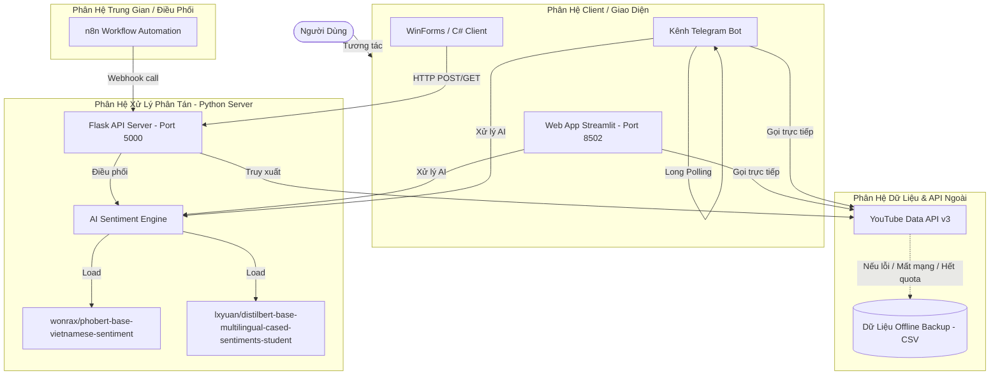

# 🤖 AI Comment Analyzer Pro - Hướng Dẫn Khởi Chạy Đa Nền Tảng

Dự án **AI Comment Analyzer Pro** là hệ thống phân tích cảm xúc bình luận thời gian thực sử dụng trí tuệ nhân tạo (PhoBERT & DistilBERT) với kiến trúc phân tán. Tài liệu này hướng dẫn chi tiết cách cài đặt và khởi chạy dự án trên các hệ điều hành khác nhau (**Windows**, **macOS**, và **Linux**).

---

## 📐 Kiến trúc Hệ thống Phân tán (Distributed Architecture)



---

## 📋 Yêu Cầu Hệ Thống

Trước khi bắt đầu, hãy đảm bảo máy tính của bạn đã cài đặt:
1. **Python 3.8 - 3.11** (Khuyến nghị bản **3.10.x** để tương thích tốt nhất với PyTorch và Underthesea).
2. **Git** (Để quản lý mã nguồn).

> [!IMPORTANT]
> **Đối với người dùng Windows:** Khi cài đặt Python, bắt buộc phải tích chọn vào ô **"Add python.exe to PATH"** ở màn hình đầu tiên để có thể chạy được các lệnh Python từ cửa sổ dòng lệnh (CMD/PowerShell).

---

## 🛠️ Hướng Dẫn Cài Đặt Chi Tiết

Hãy mở Terminal (hoặc CMD/PowerShell) tại thư mục dự án `HTPTBinhLuan` và chạy các lệnh tương ứng với hệ điều hành của bạn:

### 1. Tạo môi trường ảo (Virtual Environment)
Môi trường ảo giúp các thư viện của dự án không bị xung đột với các ứng dụng Python khác trên máy của bạn.

*   **Tất cả hệ điều hành:**
    ```bash
    python -m venv .venv
    ```

### 2. Kích hoạt môi trường ảo
Sau khi tạo, bạn cần kích hoạt môi trường ảo lên. Bạn sẽ thấy chữ `(.venv)` xuất hiện ở đầu dòng lệnh.

*   **Windows (Command Prompt - CMD):**
    ```cmd
    .venv\Scripts\activate.bat
    ```
*   **Windows (PowerShell):**
    ```powershell
    .venv\Scripts\Activate.ps1
    ```
    *(Nếu lỗi Permission, chạy lệnh: `Set-ExecutionPolicy -Scope Process -ExecutionPolicy Bypass` rồi chạy lại lệnh trên)*
*   **macOS / Linux (Terminal):**
    ```bash
    source .venv/bin/activate
    ```

### 3. Cài đặt các thư viện cần thiết
Nâng cấp công cụ quản lý thư viện `pip` và cài đặt các dependencies từ file `requirements.txt`:

*   **Tất cả hệ điều hành:**
    ```bash
    python -m pip install --upgrade pip
    pip install -r requirements.txt
    ```

### 4. Huấn luyện thử nghiệm mô hình AI (Chỉ cần chạy 1 lần đầu)
Trước khi chạy giao diện chính hoặc server, bạn hãy chạy file huấn luyện để sinh ra mô hình phân loại cục bộ và bộ từ điển:

*   **Tất cả hệ điều hành:**
    ```bash
    python main.py
    ```
    *Lệnh này sẽ gộp các file dữ liệu CSV, huấn luyện mô hình Naive Bayes và lưu lại thành `mo_hinh_ai.pkl` và `bo_tu_dien.pkl`.*

---

## 🚀 Hướng Dẫn Khởi Chạy Từng Phân Hệ

Khi chạy dự án, bạn hãy mở các cửa sổ dòng lệnh độc lập, kích hoạt môi trường ảo (`.venv`) và chạy các lệnh dưới đây tùy theo phân hệ bạn muốn mở:

### 1️⃣ Giao diện Web (Streamlit Web Dashboard)
Dành cho người dùng tương tác trực quan qua trình duyệt web.
```bash
streamlit run app.py
```
*   **Địa chỉ truy cập:** [http://localhost:8502](http://localhost:8502) (Hoặc cổng hiển thị trên Terminal).
*   **Tính năng:** Nhập link MXH/E-commerce, hệ thống tự động cào bình luận, phân tích cảm xúc, vẽ biểu đồ tròn, biểu đồ xu hướng, từ khóa nổi bật và gửi báo cáo về Telegram.

### 2️⃣ Telegram Bot (Trình tương tác tự động qua Telegram)
Dành cho việc điều phối và tương tác từ xa qua ứng dụng di động.
```bash
python telegram_bot.py
```
*   **Hoạt động:** Bot sẽ chạy ngầm và lắng nghe tin nhắn chứa link của người dùng gửi đến bot Telegram, sau đó phân tích và trả về kết quả dạng văn bản nhanh chóng.

### 3️⃣ Flask API Server (Kiến trúc phân tán Microservice)
Cổng kết nối dành cho các ứng dụng client khác (như C# WinForms hoặc n8n) truy cập và lấy dữ liệu phân tích dạng JSON.
```bash
python api_server.py
```
*   **Địa chỉ API:** `http://localhost:5000`
*   **Kiểm tra trạng thái (GET):** `http://localhost:5000/api/status`
*   **Gọi phân tích cảm xúc (POST/GET):** `http://localhost:5000/api/analyze`
    *   *Tham số JSON:* `{ "url": "LINK_YOUTUBE", "lang": "vi", "max_comments": 200 }`

### 4️⃣ Tích hợp C# qua CLI (Dự đoán dòng lệnh)
Nếu bạn tích hợp trực tiếp vào WinForms C# thông qua khởi chạy Process, sử dụng script này:
```bash
python predict_service.py "LINK_YOUTUBE_HOAC_SHOPEE"
```
*   *Kết quả sẽ trả về trực tiếp ở định dạng chuẩn JSON trên dòng lệnh (Console Output).*

---

## ⚡ Khởi Chạy Nhanh Bằng Lệnh Tự Động (One-click)

Để không phải gõ từng lệnh cấu hình phức tạp, dự án cung cấp sẵn file chạy tự động:

### Trên Windows
Nhấp đúp chuột vào file **`run_app.bat`** ở thư mục gốc. 
*   File bat này sẽ tự kiểm tra Python, tự tạo `.venv`, cài đặt các thư viện cần thiết nếu chưa có, và tự động chạy ứng dụng Streamlit trên trình duyệt của bạn.

### Trên macOS / Linux
Bạn có thể cấp quyền và chạy file bash tự động bằng cách gõ:
```bash
chmod +x run_app.sh
./run_app.sh
```
*(Nếu chưa có file `run_app.sh`, bạn có thể tạo một file mới với nội dung kích hoạt `.venv` và chạy `streamlit run app.py`)*
